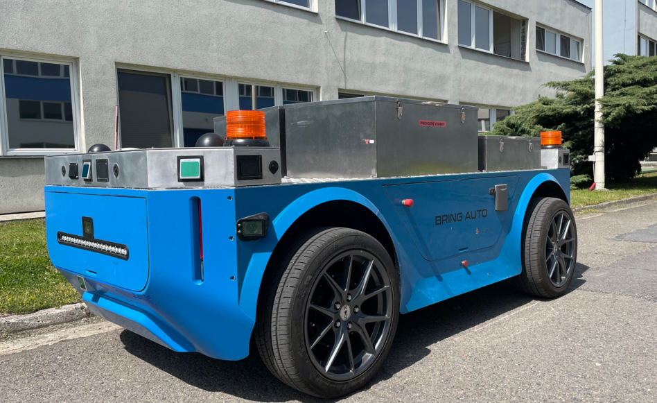
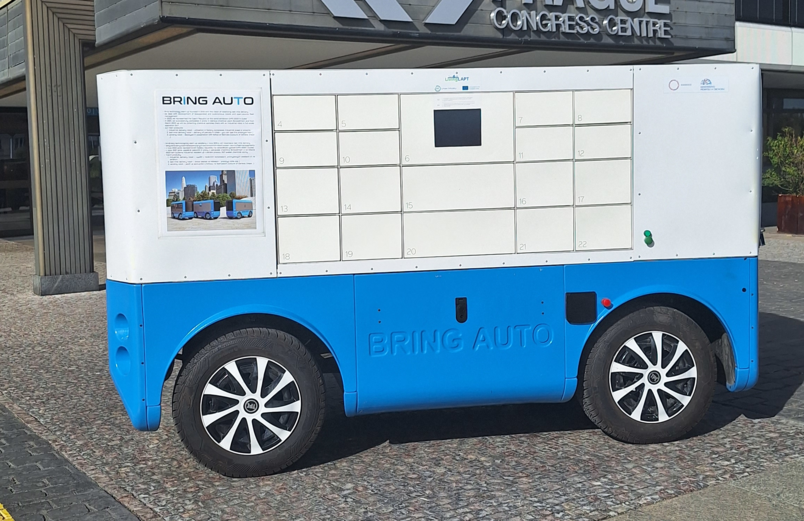

## BringAuto GitHub Page

  
  

**BringAuto develops, produces, and operates outdoor Last-Mile-Delivery autonomous robots for logistics in an industrial environment.**

As an illustration watch https://www.youtube.com/watch?v=UZCz01Q_D34

Our technologies are highly based on open-source projects and as open-source enthusiasts BringAuto provides
many in-house developed technologies as an open-source

## Projects

- [Fleet Protocol]
- [Packager] - simple yet reliable dependency management mainly for C++ projects
- [BringAuto Pi] - compute platform based on Raspberry Pi for SW Validation and Verification purposes

[Fleet Protocol]: https://github.com/bringauto/fleet-protocol
[Packager]: https://github.com/bringauto/packager
[BringAuto Pi]: https://github.com/bringauto/pi-3d-models